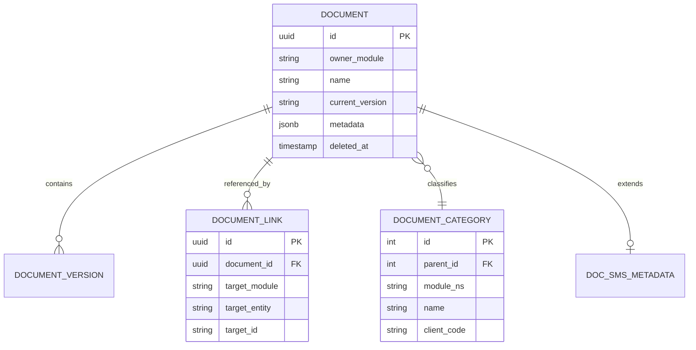
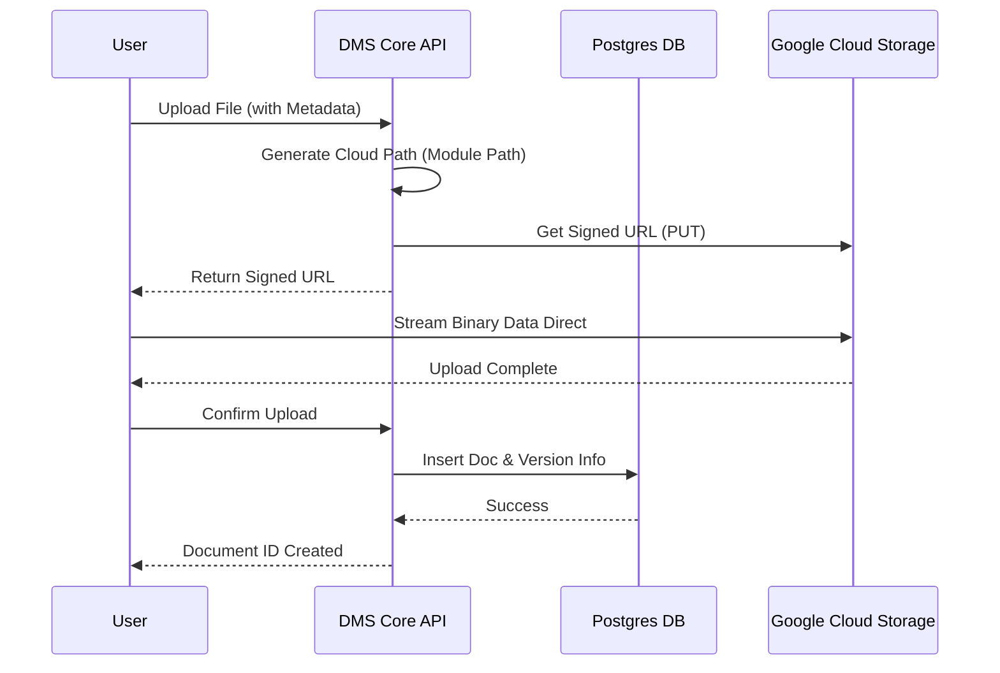

# DMS(Document Management System) 컨셉 디자인 분석 및 제안

현재 PMS 기반의 문서 관리를 전사적 공통 모듈(DMS)로 격상시키기 위한 설계 변경 사항을 진단하고 리스크 대응 방안을 제안합니다.

## 1. 리스크 진단 및 해결 방안 (Mitigation Plan)

### Q1. DB Schema Flexibility (분류 체계의 유연성)
*   **진단:** 현재 `category`, `type` 컬럼만으로는 모듈별(SMS, EMS 등)로 상이한 계층 구조를 표현하기에 한계가 있음.
*   **해결책:**
    *   **Hierarchical Category:** `parent_id`를 가진 `document_categories` 테이블을 별도로 분리하여 범용적인 트리 구조 지원.
    *   **Module Namespace:** `source_module` (e.g., 'PMS', 'SMS') 컬럼을 추가하여 각 모듈의 분류 체계를 네임스페이스로 격리.
    *   **Mapping Table:** 고객사별(삼성/LG) 코드를 관리하는 별도의 매핑 테이블(`category_mappings`)을 두어 원본 데이터 수정 없이 출력 요구사항 대응.

### Q2. Cross-Domain Integrity (참조 무결성)
*   **진단:** 타 모듈(SMS)에서 PMS 테이블을 참조할 때, 물리적인 삭제(Hard Delete) 시 데이터 유실 위험.
*   **해결책:**
    *   **Soft Delete 도입:** `deleted_at` 컬럼을 추가하여 물리적 삭제 대신 논리적 삭제 수행.
    *   **Reference Counter/Link Table:** `document_links` 테이블을 생성하여 어떤 모듈의 어떤 ID가 해당 문서를 참조하고 있는지 기록. 링크가 존재하는 문서는 삭제 방어 로직 적용.

### Q3. Performance Isolation (성능 격리)
*   **진단:** 5TB 대용량 파일 처리 및 파일명 변환 로직이 메인 API 서버(Node.js)의 이벤트 루프를 차단할 수 있음.
*   **해결책:**
    *   **Signed URL 활용:** 이미 구현된 GCS Signed URL을 적극 활용하여 파일 업로드/다운로드 트래픽을 GCS로 직접 분산(서버 부하 최소화).
    *   **Sidecar/Micro-task Worker:** 파일 변환이나 무거운 CPU 작업은 별도의 Worker(또는 Lambda/Cloud Functions)로 분리하거나, `bullmq` 등을 이용한 비동기 백그라운드 처리.

## 2. 범용성 및 확장성 설계 (Generic Design)

### Q4. Schema Generic Design
*   **제안:** `documents` 테이블에 다음 핵심 식별자 추가
    *   `owner_module`: 'PMS', 'SMS', 'EMS' 등 소유 모듈 식별
    *   `ref_entity_type`: 참조하는 도메인 객체 타입 (예: 'RiskAssessment', 'Checklist')
    *   `ref_entity_id`: 참조하는 객체의 PK

### Q5. Metadata Flexibility (속성 확장성)
*   **제안:** **Hybrid 전략 (JSONB + Extension Table)**
    *   검색 빈도가 낮고 유연성이 중요한 메타데이터는 기존의 **JSONB** 필드(`metadata`) 유지.
    *   검색/필터링이 잦거나 제약 조건이 필요한 핵심 데이터(예: 결재 상태)는 **1:1 확장 테이블**(`doc_sms_metadata` 등)로 분리하여 스키마 오염 방지.

### Q6. Phased Launch Strategy
*   **제안:**
    *   **Naming Service Provider:** 업로드 시 파일명 규칙을 각 모듈이 주입할 수 있도록 인터페이스화.
    *   **Version Pinning:** PMS가 안정화된 상태에서 SMS를 붙일 때, PMS의 기존 API Version을 유지하고 SMS는 새로운 API 버전(V2) 또는 Namespace를 통해 상호 영향 최소화.

## 3. 구조 제안 (ERD & Data Flow)

### ERD Structure (Conceptual)

### Data Flow (Simplified)

