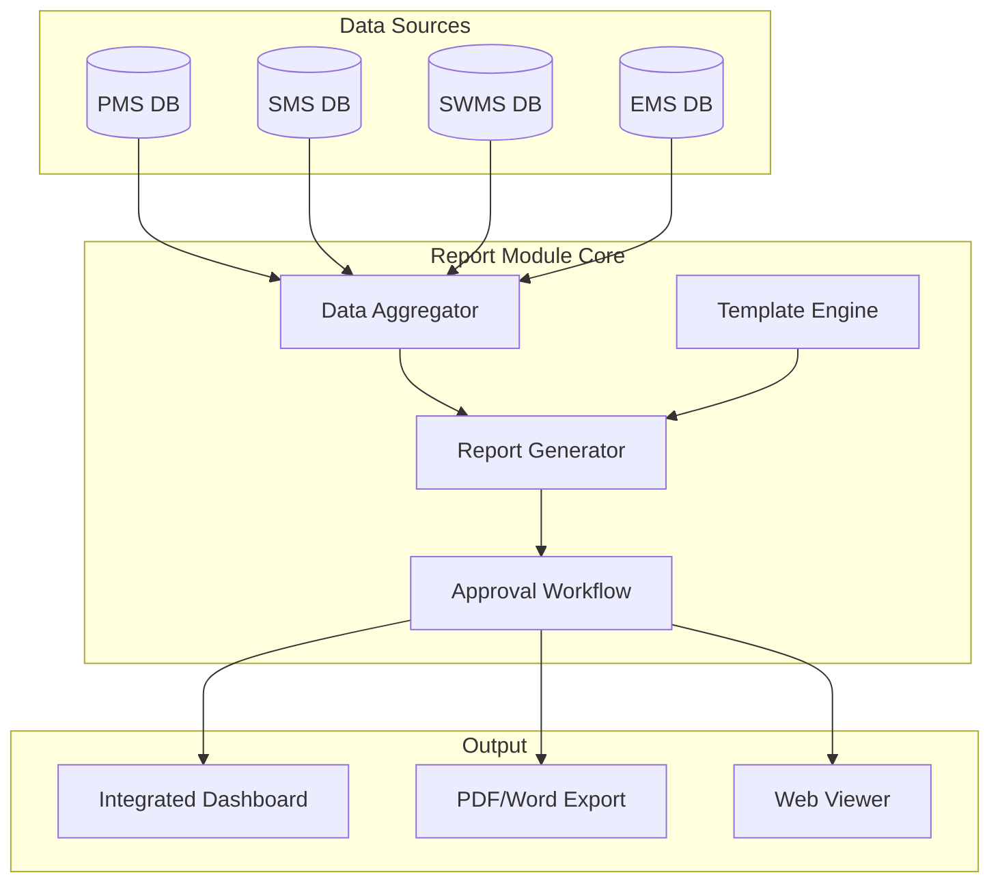

# PMS/SMS/SWMS/EMS 통합 보고 모듈 개발 계획

## 1. 목적
본 문서는 기존 PMS/SMS/SWMS 보고 기능뿐 아니라 EMS(장비관리시스템)의 보고 기능을 포함하여 크로스특수㈜의 모든 주요 업무 흐름을 통합하는 보고 체계를 정의한다.

**목표:**
*   장비 가동·정비·배차 등 핵심 데이터를 포함한 전사 통합 보고 체계 구축
*   각 모듈에서 전문 보고서를 생성하고, PMS에서 이를 통합하는 구조 제공
*   고객사 대응용 고품질 보고서 자동 생성
*   AI 기반 장비 예지정비/효율 분석 보고서까지 확장 가능하도록 설계

## 2. 보고 모듈이 포함하는 전체 업무 시스템

| 시스템 | 설명 |
| :--- | :--- |
| **PMS** | 프로젝트 공정·자원·원가 중심 |
| **SMS** | 안전(RA·DRI·점검·사고) 중심 |
| **SWMS** | 스크랩/폐기물 반출·정산 중심 |
| **EMS** | 장비·정비·배차·고장·점검 중심 |

## 3. 보고서 유형 (Report Types) – 전사 표준 통합 정리

크로스특수㈜의 모든 업무 시스템(PMS/SMS/SWMS/EMS)은 아래 네 가지 영역의 보고서를 생산하며, 각 보고서는 **실무자 작성 → PMS 통합 → PM 검토 → 고객사 제출** 구조를 따른다.

### 3.1 PMS 보고서 유형 (프로젝트 중심 보고)
프로젝트 수행을 위한 공정·자원·원가 중심의 핵심 보고서.

| 보고서 유형 | 설명 |
| :--- | :--- |
| **일일작업보고(Daily Report)** | 작업 완료·계획·이슈·사진 자동 포함 |
| **주간공정보고(Weekly Progress Report)** | WBS별 공정률/지연/자원투입 주간 트렌드 |
| **월간종합보고(Monthly Project Report)** | 공정·자원·안전·스크랩·장비 포함한 프로젝트 종합 대시보드 |
| **공정 진척 보고(Gantt 기반)** | 지연 공정 자동 표시, 변경이력 포함 |
| **자원 투입 보고(Resource Report)** | 인력·장비 투입량 및 예산 대비 집행 |
| **원가 및 실행 분석보고(Cost/S-Curve)** | 실행예산 대비 지출, CCP 기반 예측 |
| **리스크·이슈 보고** | 위험도, 대응계획, 영향도 자동 산정 |

### 3.2 SMS 보고서 유형 (안전관리 중심)
현장 안전관리의 법적 준수·위험예방·사고방지를 목표로 하는 보고서.

| 보고서 유형 | 설명 |
| :--- | :--- |
| **RA(위험성평가) 보고서** | 작업별 위험 요소/위험도 계산/개선대책 포함 |
| **DRI(일일작업 위험예측) 보고서** | 당일 작업 위험예측 자동 생성 |
| **안전 패트롤 점검 보고서** | 점검 체크리스트/사진·GPS·조치내용 포함 |
| **사고·아차사고 보고서** | 사고 원인·재발방지대책·근본원인 분석(RCA) |
| **교육 보고서** | 정기교육·특별교육 이수 현황 |
| **부적합(NC) 조치보고** | 위험 사항 조치결과 및 담당자 기록 |
| **AI 위험 감지 보고서 (Phase II)** | PPE 미착용/위험 작업 조합 자동 감지 결과 요약 |
| **바디캠/웨어러블 위험 탐지 보고(Phase II)** | 실시간 위험 이벤트 자동 기록 및 요약 |

### 3.3 SWMS 보고서 유형 (스크랩·폐기물 중심)
계근·반출·정산 등 데이터 기반 수익 및 법적 준수 관리 보고서.

| 보고서 유형 | 설명 |
| :--- | :--- |
| **계근 입출 보고서** | 차량/품목/중량/입출시간 자동 기록 |
| **반출 사진 보고서** | 현장 사진 및 증빙자료 자동 첨부 |
| **반출량 분석보고(일·주·월)** | 품목별·프로젝트별 반출 물량 트렌드 |
| **정산 보고서** | 스크랩 단가·중량 기반 정산금액 자동 계산 |
| **고객사 제출용 보고서** | 삼성/LG 전용 양식 자동 변환 |
| **폐기물 처리 보고서** | 법적 코드/운반·처리업체 정보 포함 |
| **비정상 패턴 AI 분석보고(Phase II)** | 야간반출/소량반복 등 이상 패턴 탐지 |

### 3.4 EMS 보고서 유형 (장비관리 중심)
장비투입, 유지보수, 배차, 비용관리 등 장비 운영의 성능·안정성·효율성을 분석하는 보고서.

**A) 장비 가동률 보고서 (Utilization Report)**
*   장비별 총 가동시간/비가동시간/고장시간
*   프로젝트별 가동률/유휴율
*   현장별 장비 분포 현황
*   **KPI:** Utilization Rate, Idle Rate, Productivity Index

**B) 정비·고장 이력 보고서 (Maintenance/Breakdown Report)**
*   정기점검 이력 및 다음 점검 예정일
*   고장 발생 건수·유형·심각도 통계, MTBF, MTTR
*   정비 소요 비용, 정비 리드타임 분석
*   AI 기반 고장 예측 결과(Phase II)

**C) 배차·이동 보고서 (Dispatch/Movement Report)**
*   장비 배차 기록 (일자/현장/작업내용)
*   중복 배차 발생 여부 자동 표시
*   GPS/UWB 이동 경로 및 이동시간, 장비 가용성(Availability) 분석
*   AI 배차 추천 모델 결과(Phase II)

**D) 비용·원가 보고서 (Cost Analysis Report)**
*   장비별 유지·정비·운행·운송 비용
*   프로젝트별 장비 원가 배분 내역
*   리스/대여 장비 비용 비교
*   장비 교체·폐기 적정성 분석
*   AI 기반 장비 효율 점수(Efficiency Score)

### 3.5 전사 통합 보고서 유형 (PMS에서 최종 생성)
PMS는 모든 모듈의 요약 데이터를 받아 다음 보고서를 생성한다:

| 보고서 유형 | 포함 모듈 |
| :--- | :--- |
| **주간 프로젝트 통합보고서** | PMS + SMS + SWMS + EMS |
| **월간 프로젝트 종합보고서(Executive)** | PMS + SMS + SWMS + EMS |
| **고객사 제출 보고서** | PMS(표지/정리) + 실데이터(각 모듈) |
| **리스크 종합 분석** | 공정·안전·장비·스크랩 리스크 |
| **프로젝트 비용·자원 종합 분석** | PMS + EMS |

**통합 보고서 구성 섹션 (자동):**
1.  공정 진척 (PMS)
2.  안전 현황 (SMS)
3.  스크랩/정산 현황 (SWMS)
4.  장비 가동/정비/배차 현황 (EMS)
5.  리스크/이슈 요약

## 4. 핵심 기능 요구사항

### 4.1 보고 자동생성 기능 (Report Auto-Generation)
*   **데이터 연동:** PMS 공정(WBS)/자원, SMS 점검/사고, SWMS 계근, EMS 장비 데이터 자동 삽입.
*   **Auto-fill:** 사진 자동 선정(일/주간 주요), 진행률 계산, 투입 현황, 이슈 요약 등 자동 채움.
*   **고객사 포맷팅:** 삼성/LG 등 고객사 제출용 문서 자동 포맷팅.
*   **AI 고도화(Phase II):** 문장 자동 요약, 위험 패턴 분석, 맞춤형 문장 생성.

### 4.2 보고 템플릿 관리 기능
*   보고서 템플릿 생성/편집 (Word/PDF/HTML 기반).
*   고객사별 템플릿 저장 및 관리.
*   고정 구성요소(CI, 표지, 서명란) 관리.

### 4.3 공정(Progress) 보고 기능
*   실시간 공정 진행률(계획 vs 실적) 계산.
*   지연 구간 자동 표시 및 설명 입력.
*   시각화: Gantt Chart, Resource Burn-down Chart, S-curve.

### 4.4 안전 보고 기능
*   패트롤 점검 결과 및 RA 위험도 분석 결과 반영.
*   사고/아차사고 히스토리 시각화.
*   KPI: 부적합 개선율, Safety Score, 위험구역 접근 횟수.

### 4.5 스크랩·폐기물 보고 기능
*   계근표 자동 수집, 반출 차량별 데이터 집계.
*   품목별/일자별/프로젝트별 통계 및 정산서 자동 생성.

### 4.6 보고서 승인 Workflow
*   **프로세스:** 작성 → 검토 → 승인 → 배포.
*   프로젝트별 승인자 지정, 반려 사유 기록, 이력 저장.
*   승인 완료 후 수정 제한(Revision).

### 4.7 보고서 배포 기능
*   내부 배포(메일/알림), 고객사 공유 링크, 다운로드 제한, 열람 로그.

### 4.8 시각적 대시보드 지원
*   프로젝트별 공정/안전/자원/스크랩/이슈/Risk Heatmap 대시보드 제공.

### 4.9 보고서 관리 효율화 방안 (대량 데이터 대응)
경영진 및 관리자가 수많은 보고서를 효율적으로 검토하기 위한 전략:
1.  **Dashboard View 도입:** 캘린더 및 대시보드 형태의 UI를 제공하여, 개별 보고서를 리스트로 찾는 것이 아니라 "오늘의 현황"을 한눈에 파악하고 필요 시 상세 진입.
2.  **Exception-based Review (예외 중심 검토):** 모든 보고서를 승인하는 것이 아니라, **'지연(Delay)', '사고(Accident)', '이슈(Issue)'**가 포함된 보고서만 하이라이트하여 우선 검토.
3.  **Auto-Aggregation (자동 병합):** 일일 보고서를 묶어 **'주간 요약 보고서'**를 자동 생성, 경영진은 주간 보고서만 검토해도 충분하도록 구성.

## 3.6 UI 및 사용자 경험 설계 (Refined Phase 1)
*   **List + Modal 구조:** 목록 화면을 넓게 활용하여 현황 파악을 용이하게 하고, 상세 내용은 모달 팝업으로 띄워 편집/결재/인쇄 등의 작업을 집중도 있게 수행.
*   **즉시 작성(Quick Create):** 모달 내에서 데이터 자동 로드 후 즉시 보고서 생성 및 결재 상신.

## 5. 아키텍처 및 개발 계획 (Architecture & Roadmap)

### 5.1 시스템 아키텍처 (Conceptual)


### 5.2 데이터베이스 스키마 설계 (Draft)
```sql
-- 보고서 템플릿
CREATE TABLE report_templates (
    id UUID PRIMARY KEY,
    title VARCHAR(100),
    type VARCHAR(50), -- DAILY, WEEKLY, MONTHLY, SAFETY, ETC
    layout_config JSONB,
    created_at TIMESTAMP
);

-- 생성된 보고서
CREATE TABLE reports (
    id UUID PRIMARY KEY,
    project_id UUID,
    template_id UUID,
    title VARCHAR(200),
    report_date DATE,
    status VARCHAR(20), -- DRAFT, PENDING, APPROVED, REJECTED
    content JSONB, -- Actual data snapshot
    created_by VARCHAR(100),
    created_at TIMESTAMP
);

-- 승인 라인
CREATE TABLE report_approvals (
    id UUID PRIMARY KEY,
    report_id UUID,
    approver_id VARCHAR(100),
    step INTEGER,
    status VARCHAR(20),
    comment TEXT,
    updated_at TIMESTAMP
);
```

### 5.3 개발 로드맵
1.  **Phase 1: 기반 구축 (✅ 완료 - 2025-12-12)** 
    - ✅ DB 설계 (reports, report_templates 테이블)
    - ✅ 기본 일일/주간/월간 보고 시스템 구현
    - ✅ 보고서 목록/상세 UI (List + Modal 구조)
    - ✅ 보고서 생성/수정/삭제 기능
    - ✅ 보고서 뷰어/에디터 컴포넌트
    - ✅ Firebase Functions API 연동
    - ✅ 자동 데이터 집계 (PMS/SMS/EMS/SWMS)
    
2.  **Phase 2: 워크플로우 고도화 (진행 예정)**
    - [ ] 승인 결재선 구현
    - [ ] 보고서 상태 관리 강화
    - [ ] 임원용 대시보드
    - [ ] 보고서 배포 기능
    
3.  **Phase 3: 템플릿 및 포맷팅**
    - [ ] 고객사별 템플릿 관리
    - [ ] PDF/Word 내보내기
    - [ ] 자동 변환 기능 (tech_memo_conversion.md 참조)
    
4.  **Phase 4: AI 고도화 (Phase II)**
    - [ ] AI 기반 문장 자동 요약
    - [ ] 위험 패턴 분석
    - [ ] 장비 예지정비 분석

---

## 6. 최근 업데이트 이력

### 2025-12-12 (Phase 1 완료)
**구현 완료:**
- Reports 페이지 UI 개선 (녹색 버튼, 문서 아이콘, 네온 그림자)
- 보고서 삭제 기능 추가
- Firebase Functions에 Reports API 통합
- Reports 테이블 자동 초기화
- Linting 오류 수정 및 코드 정리
- 프론트엔드/백엔드 배포 완료

**다음 단계:**
- 임원용 대시보드 구현
- 승인 프로세스 E2E 테스트
- 자동 보고서 변환 기능 (Phase 1 - tech_memo_conversion.md)

